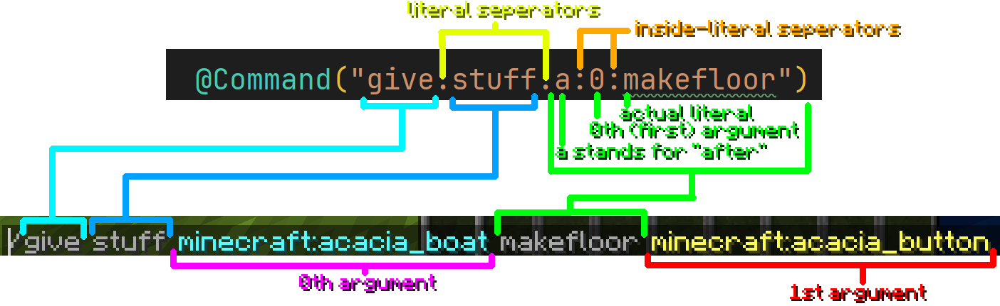

# Arn

Arn is an annotation-based command library inspired by Spring boot that helps spigot plugins with creating, handling and
registering commands. This library uses Brigaider commands that Minecraft uses, so you can use most kinds of arguments
you see in the commands of the original game. Plus, you can turn any enumerator to a custom argument, all it takes is
literally two annotations. Then, let's get started!

## Installation

### for Maven

Add this repository:
```xml
<repository>
    <id>efekosdev</id>
    <url>https://efekos.dev/maven</url>
</repository>
```

Add this dependency:
```xml
<dependency>
    <groupId>dev.efekos</groupId>
    <artifactId>Arn</artifactId>
    <version>0.1.0</version>
</dependency>
```

### for Gradle:

Add this repository:
```gradle
maven { url 'https://efekos.dev/maven' }
```

Add this dependency:
```gradle
implementation 'dev.efekos:Arn:0.1.0'
```

## Usage

Arn uses Java Reflection API to scan through your plugin, detect needed classes and use them. Because of this, you have
to add a [`Container`](https://efekos.dev/javadoc/arn/0.1.1/dev/efekos/arn/annotation/Container.html) annotation to
**every** class that must be scanned by [`Arn`](https://efekos.dev/javadoc/arn/0.1.1/dev/efekos/arn/Arn.html).

### Creating commands

Let's create a new class using the knowledge we know so far.

````java
import dev.efekos.arn.annotation.Container;

@Container
public class CommandClass {

}
````

Normally you need to either handle your command through events or create a
[`Command`](https://hub.spigotmc.org/javadocs/spigot/org/bukkit/command/Command.html) class for it. But in Arn, all you
have to do is add a method with such annotations.

````java
import dev.efekos.arn.annotation.Command;
import org.bukkit.command.CommandSender;

@Command("helloworld") // command name
public int helloWorld(CommandSender sender /*get the sender*/) {
    sender.sendMessage("Hello World!");
    return 0;
}
````

When scanned and registered, this method will be equivalent of command `/helloworld`, that takes no arguments and says
"Hello World!" back to the sender. Now you might be thinking about arguments. That is pretty easy.

````java
import dev.efekos.arn.annotation.Command;
import dev.efekos.arn.annotation.CommandArgument;
import org.bukkit.command.CommandSender;

@Command("hello")
public int helloWorld(CommandSender sender, @CommandArgument String name /*string argument*/) {
    sender.sendMessage("Hello "+name+"!");
    return 0;
}
````

All we have to do is add a parameter with
[`CommandArgument`](https://efekos.dev/javadoc/arn/0.1.1/dev/efekos/arn/annotation/CommandArgument.html) annotation. This
method is now the equivalent of `/helloworld <name>`, `<name>` being a `String` that can have whitespaces using quoted
strings. You can use following combinations of annotations and types by default (all of them requires
[`CommandArgument`](https://efekos.dev/javadoc/arn/0.1.1/dev/efekos/arn/annotation/CommandArgument.html).):

* [`Advancement`](https://hub.spigotmc.org/javadocs/spigot/org/bukkit/advancement/Advancement.html)
* [`Attribute`](https://hub.spigotmc.org/javadocs/spigot/org/bukkit/attribute/Attribute.html)
* [`@Block`](https://efekos.dev/javadoc/arn/0.1.1/dev/efekos/arn/annotation/modifier/Block.html) [`Material`](https://hub.spigotmc.org/javadocs/spigot/org/bukkit/Material.html)
* [`BlockData`](https://hub.spigotmc.org/javadocs/spigot/org/bukkit/block/data/BlockData.html)
* `Boolean`
* `boolean`
* [`World`](https://hub.spigotmc.org/javadocs/spigot/org/bukkit/World.html)
* `Double`
* `double`
* [`PotionEffectType`](https://hub.spigotmc.org/javadocs/spigot/org/bukkit/potion/PotionEffectType.html)
* [`Enchantment`](https://hub.spigotmc.org/javadocs/spigot/org/bukkit/enchantments/Enchantment.html)
* [`Entity`](https://hub.spigotmc.org/javadocs/spigot/org/bukkit/entity/Entity.html)
* `Float`
* `float`
* [`GameMode`](https://hub.spigotmc.org/javadocs/spigot/org/bukkit/GameMode.html)
* `Integer`
* `int`
* [`@InventorySlot`](https://efekos.dev/javadoc/arn/0.1.1/dev/efekos/arn/annotation/modifier/NumberLimitations.html) `Integer`
* [`@InventorySlot`](https://efekos.dev/javadoc/arn/0.1.1/dev/efekos/arn/annotation/modifier/NumberLimitations.html) `int`
* [`@Item`](https://efekos.dev/javadoc/arn/0.1.1/dev/efekos/arn/annotation/modifier/Item.html) [`Material`](https://hub.spigotmc.org/javadocs/spigot/org/bukkit/Material.html)
* [`ItemStack`](https://hub.spigotmc.org/javadocs/spigot/org/bukkit/inventory/ItemStack.html)
* [`Location`](https://hub.spigotmc.org/javadocs/spigot/org/bukkit/Location.html)
* `Long`
* `long`
* [`Entity`](https://hub.spigotmc.org/javadocs/spigot/org/bukkit/entity/Entity.html)\[]
* [`Player`](https://hub.spigotmc.org/javadocs/spigot/org/bukkit/entity/Player.html)\[]
* [`Player`](https://hub.spigotmc.org/javadocs/spigot/org/bukkit/entity/Player.html)
* `String`
* [`BaseComponent`](https://javadoc.io/doc/net.md-5/bungeecord-chat/latest/net/md_5/bungee/api/chat/BaseComponent.html)
* [`@Vector`](https://efekos.dev/javadoc/arn/0.1.1/dev/efekos/arn/annotation/modifier/Vector.html) [`Location`](https://hub.spigotmc.org/javadocs/spigot/org/bukkit/Location.html)

These don't require a [`CommandArgument`](https://efekos.dev/javadoc/arn/0.1.1/dev/efekos/arn/annotation/CommandArgument.html)
annotation.

* [`BlockCommandSender`](https://hub.spigotmc.org/javadocs/spigot/org/bukkit/command/BlockCommandSender.html)
* [`CommandSender`](https://hub.spigotmc.org/javadocs/spigot/org/bukkit/command/CommandSender.html)
* [`ConsoleCommandSender`](https://hub.spigotmc.org/javadocs/spigot/org/bukkit/command/ConsoleCommandSender.html)
* [`Player`](https://hub.spigotmc.org/javadocs/spigot/org/bukkit/entity/Player.html)

By default, name of an argument is same with name of the parameter. If you want, you can explicitly specify argument
names like this.

````java
public int method(@CommandArgument("name") String s);
````

### Using parameter names as argument names

If you don't specify argument names and let Arn use parameter names instead, you'll probably face a problem. Maven does
not compile applications with parameter names. In order to solve this problem, you can add small configuration to your
`maven-compiler-plugin`. It is something like this:

````xml
<plugin>
    <artifactId>maven-compiler-plugin</artifactId>
    <configuration>
        <parameters>true</parameters>
    </configuration>
    <!-- ... -->
</plugin>
````

I use Maven, so I don't know a solution for Gradle. It is probably something easy like it is in Maven, so you can fix it
with a bit of research.

### Advanced literals

I only showed you how to make base commands. There is more than base commands in Arn. If you want to use two or more
literals, you can simply separate them with `.` in your [`CommandArgument`](https://efekos.dev/javadoc/arn/0.1.1/dev/efekos/arn/annotation/CommandArgument.html)
annotation. But in this way, arguments will be placed after all the literals. If you want to place literals between
arguments, you can follow this syntax: `[ab]:[0-9]+:[a-z]+`. First group of a letter determines will this literal be placed before
or after the argument with the given index. Second group of a number is the index of an argument. Finally, last group of
a lowercase word is the actual literal. Let me explain how it works more with this graph:



As you can see, the last literal 'makefloor' is placed after 0th argument. This is because the first letter is 'a' and
the index is `0`. If the letter was 'b', the literal would be placed after second literal 'stuff'. If the index was `1`,
the literal would be placed after the 1st argument.

### Custom arguments

If you want to make a custom argument, you can, using Enum classes! All you have to do is annotate an enum class with both
[`Container`](https://efekos.dev/javadoc/arn/0.1.1/dev/efekos/arn/annotation/Container.html) and [`CustomArgument`](https://efekos.dev/javadoc/arn/0.1.1/dev/efekos/arn/annotation/CustomArgument.html),
and you'll be able to use that enum class as a command argument.

````java
// Rating.java

import dev.efekos.arn.annotation.Command;
import dev.efekos.arn.annotation.CommandArgument;
import dev.efekos.arn.annotation.Container;
import dev.efekos.arn.annotation.CustomArgument;
import org.bukkit.entity.Player;

@Container
@CustomArgument()
public enum Rating {
    TRASH,
    BAD,
    MID,
    GREAT,
    GOAT
}

// Commands.java

@Container
public class Commands {

    @Command("rate")
    public int rate(@CommandArgument Rating rating, @CommandArgument String message, Player sender) {
        player.sendMessage("Thanks for your rating!");
        return 0;
    }
    
}
````

### Blocking access

You can block access by using a permission or annotations. All you have to do is add the permission node to the
[`Command`](https://efekos.dev/javadoc/arn/0.1.1/dev/efekos/arn/annotation/Command.html) like this:

````java
import dev.efekos.arn.annotation.Command;
import dev.efekos.arn.annotation.block.BlockCommandBlock;
import dev.efekos.arn.annotation.block.BlockConsole;
import dev.efekos.arn.annotation.block.BlockPlayer;

@Command(value = "this.is.command.name", permission = "methods.cmd.method")
@BlockPlayer // Blocks access to players
@BlockCommandBlock // Blocks access to command blocks
@BlockConsole // Blocks access to the console
public int method(/*...*/);
````

### Limits

You can apply [`NumberLimitations`](https://efekos.dev/javadoc/arn/0.1.1/dev/efekos/arn/annotation/modifier/NumberLimitations.html)
to any command argument with a number type.

````java
import dev.efekos.arn.annotation.Command;
import dev.efekos.arn.annotation.CommandArgument;
import dev.efekos.arn.annotation.block.BlockCommandBlock;
import dev.efekos.arn.annotation.modifier.NumberLimitations;

@Command("settimeout")
@BlockCommandBlock
public int setTimeout(@CommandArgument @NumberLimitations(min = 0,max = 30) Integer argument);
````

### Configurations

If you want to go even more crazy, you can implement your own command parameter types. You have to make an implementation
of [`CommandHandlerMethodArgumentResolver`](https://efekos.dev/javadoc/arn/0.1.1/dev/efekos/arn/resolver/CommandHandlerMethodArgumentResolver.html)
first. If you want to add an argument to the command structure to resolver a parameter, you might also need to make an
implementation of a [`CommandArgumentResolver`](https://efekos.dev/javadoc/arn/0.1.1/dev/efekos/arn/resolver/CommandArgumentResolver.html).
After that, simply make a [`Container`](https://efekos.dev/javadoc/arn/0.1.1/dev/efekos/arn/annotation/Container.html) that
implements [`ArnConfigurer`](https://efekos.dev/javadoc/arn/0.1.1/dev/efekos/arn/config/ArnConfigurer.html), and add your
resolvers using that configurer.

### Running

After all of your command and configurations are done, call
[`Arn`](https://efekos.dev/javadoc/arn/0.1.1/dev/efekos/arn/Arn.html)[`#run`](https://efekos.dev/javadoc/arn/0.1.1/dev/efekos/arn/Arn.html#run(java.lang.Class))
from your plugin.

````java
import dev.efekos.arn.Arn;
import org.bukkit.plugin.java.JavaPlugin;

public class MyPlugin extends JavaPlugin {

    @Override
    public void onEnable() {
        Arn.run(MyPlugin.class); // classes under the package of this class will be scanned.
    }

}
````

## License

This repository is licensed under [MIT License](https://github.com/efekos/Arn/blob/master/LICENSE).